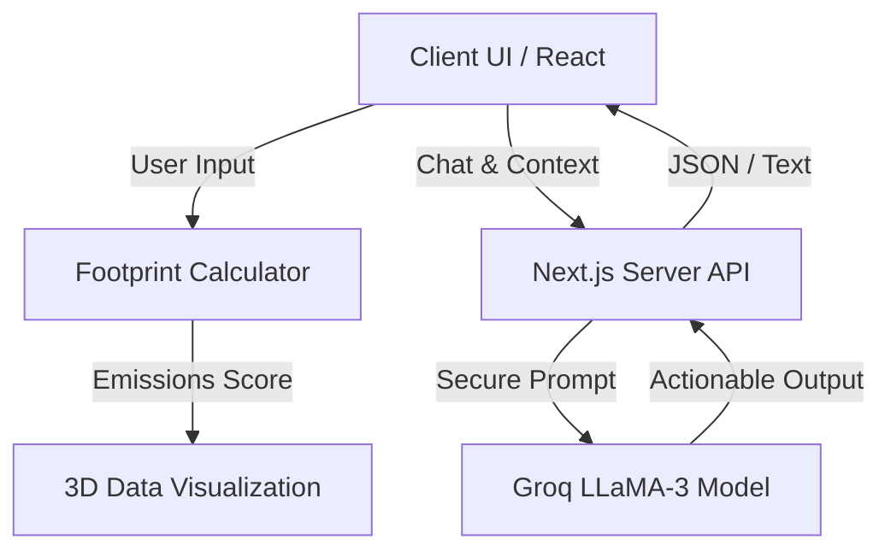

# EcoTrack 🌍


**🌟 Live Demo:** [https://ecologytrack.vercel.app/](https://ecologytrack.vercel.app/)

EcoTrack is a next-generation Carbon Footprint Awareness Platform designed to help individuals understand, track, and reduce their carbon footprint through highly interactive 3D visualizations and personalized AI insights.

## Problem Statement & Vertical
**Vertical:** Carbon Footprint Awareness
Climate change is an abstract, global issue that is difficult for individuals to grasp on a personal level. People want to help, but lack immediate feedback on how their daily habits impact the environment. EcoTrack solves this by translating complex emissions data into tangible, beautiful 3D visualizations (like measuring your footprint in "trees required to offset") and offering localized community challenges.

## Architecture & Data Flow



## How the Solution Works
EcoTrack is built as a Single Page Application (SPA) utilizing:
- **Next.js (App Router)** for fast, responsive UI and secure server-side API routes.
- **Three.js & React Three Fiber** for immersive, interactive 3D globes and data visualization.
- **Groq API (Llama 3)** powering the **EcoGuide AI** and Dynamic Community Data generation.
- **Tailwind CSS & Framer Motion** for fluid, glassmorphic UI elements and scroll animations.

Users input their monthly travel, energy, and dietary habits into the platform. The app instantly visualizes this data, categorizes their eco-tier, and the integrated EcoGuide AI assistant provides personalized recommendations to improve their score.

## Approach and Logic
Our methodology relies on transparent, logical calculations to assess footprint:
- **Transport:** Calculated per mile based on average vehicular emissions.
- **Energy:** Calculated based on monthly utility spend and average grid carbon intensity.
- **Diet:** Categorical multipliers (Vegan, Vegetarian, Meat-eater) representing the vast differences in agricultural carbon intensity.
The final output is dynamically scored, and the AI accesses this exact state to enforce logical, context-aware decision making.

## Assumptions Made
1. **Emissions Averages:** We assume global/national averages for transport per mile and energy per dollar. In a production environment, this would be hyper-localized based on the user's specific zip code and utility provider.
2. **AI Inference:** We assume the LLM provides consistently formatted JSON for the community goals, strictly adhering to our enforced schema.
3. **Offset Metrics:** The "trees required" metric assumes an average mature tree absorbs roughly 22kg of CO2 per year.

## Evaluation Criteria Highlights
- **Code Quality:** Written in strictly typed, modular React.
- **Efficiency:** 3D assets are optimized and lazy-loaded. LLM inference leverages Groq for near-instant response times.
- **Security:** All API keys are securely stored server-side in API Route handlers.
- **Accessibility:** Interactive components are built with screen-reader compatibility in mind.

---

### Running the Project Locally
```bash
npm install
npm run dev
```
Open [http://localhost:3000](http://localhost:3000) with your browser to see the result.
